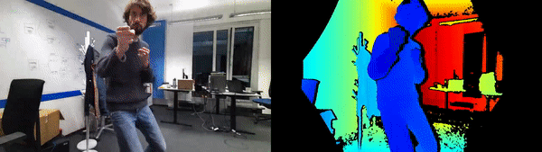

# Azure Kinect RTSP-Streamer / RTSP-Server

This Repository contains a dockerized RTSP-Streamer / Server for streaming the Kinects RGB- and Depth-Stream to network
by merging them into one Video. Our goal with this is to be independent from the actual (Kinect + Computational) Hardware
and easily use the RTSP-Stream on all kinds of clients in the local network, e.g. Microsoft Hololens.

The docker-container mainly contains a **GStreamer-Pipeline** for creating and merging the Video-Stream. The Pipeline is based
on the **Aivero RGBD Toolkit** which provides plugins for using the kinect as video-source and demuxing the color + depth streams.

https://gstreamer.freedesktop.org/

https://gitlab.com/aivero/public/aivero-rgbd-toolkit

## Usage

- clone the repository
- >git-lfs install< (repository uses large file storage for archives and videos)
- >git-lfs pull< (to make sure all dependencies are pulled and not just the lfs-pointers)

Execute the "startup.sh" if you want to use x11-server for seeing the docker-containers UI on the host system (Ubuntu 18.04/20.04 tested -> x11-server needed on host).
Otherwise docker-compose up --build is sufficient, as DISPLAY and HOSTNAME are not needed.

Usage examples can also be found in docker/x11-entry.sh and docker/rtsp-server/rtsp-entry.sh (entrypoints of the container).

The is a good chance that the streamer won't work from scratch, e.g. because kinect doesn't like your pc. For debugging you can use the
alternative Dockerfile_dev which contains e.g. the kinect sdk (k4aviewer) and some more steps.

## Sample GStreamer-Pipelines

Most of the samples use the "rtsp-simple-server" in another container, which is currently uncommented in the docker-compose.
The current solution is streaming directly from one container instead, which should me marginally faster.

### Simple kinect color + depth pipeline:
gst-launch-1.0 k4asrc enable_color=true \
! queue ! rgbddemux name=demux demux.src_depth \
! colorizer near-cut=300 far-cut=5000 \
! queue ! videoconvert ! queue \
! autovideosink demux.src_color ! queue \
! videoconvert ! autovideosink

### Receive RTSP-Stream on host (name = kinect):
gst-launch-1.0 rtspsrc latency=0 location=rtsp://localhost:8554/kinect ! rtph264depay ! decodebin ! autovideosink
-> replace >localhost< with network adress if using from another device on the same network

### Test rtsp sender with test source (uses rtsp-simple-server from docker-compose)
gst-launch-1.0 videotestsrc ! x264enc ! rtspclientsink location=rtsp://rtsp-simple-server:8554/kinect

### Color only RTSP sender
gst-launch-1.0 k4asrc enable_color=true \
! queue ! rgbddemux name=demux demux.src_color ! queue \
! videoconvert ! x264enc \
! rtspclientsink location=rtsp://rtsp-simple-server:8554/color

### Depth only RTSP sender
gst-launch-1.0 k4asrc enable_color=true \
! queue ! rgbddemux name=demux demux.src_depth \
! colorizer near-cut=300 far-cut=5000 ! queue \
! videoconvert ! x264enc \
! rtspclientsink location=rtsp://rtsp-simple-server:8554/color

### Custom colorizer
The dockerfile contains a line that replaces the "default" colorizer with a custom
prototype. The custom colorizer transforms the colors to hsv-colors instead of using a
lookup-table (as the default one does). This makes it easier to transform colors back
to depth on the receiver site.

Be aware that "near-cut" and "far-cut" work differently for this colorizer. 
near-cut: Where it starts; Internally multiplied with 256 
far-gut: How deep it goes, starting from near-cut; Internally multiplied with 256
Example: near-cut = 2, far-cut = 3
-> Depth image ranges from 2*256 to ( 2*256 + 3*256 )

### Mix to one video and stream to "rtsp-simple-server";
gst-launch-1.0 \
   k4asrc enable_color=true rectify-depth=true timestamp_mode=clock_all real-time-playback=true color-format=nv12 color-resolution=720p \    depth-mode=nfov_unbinned framerate=15fps \
   ! queue ! rgbddemux name=demux demux.src_color ! queue ! \
   videoconvert ! \
   videobox top=0 bottom=0 right=-700 ! \
   videomixer name=mix sink_0::xpos=0 sink_1::xpos=1300 ! \
   videoconvert ! x264enc ! \   
   rtspclientsink location=rtsp://rtsp-simple-server:8554/color demux.src_depth ! \
   colorizer near-cut=300 far-cut=5000 ! \
   videobox border-alpha=1 ! \
   queue ! videoconvert ! mix.

### Send RTS (not RTSP):
gst-launch-1.0 -v k4asrc enable_color=true ! queue ! rgbddemux name=demux demux.src_depth ! colorizer near-cut=300 far-cut=5000 ! queue ! videoconvert ! avenc_mpeg4 ! rtpmp4vpay config-interval=3 ! udpsink host=127.0.0.1 port=5100

### Receive RTS:
gst-launch-1.0 -v udpsrc port=5100 caps = "application/x-rtp\,\ media\=\(string\)video\,\ clock-rate\=\(int\)90000\,\ encoding-name\=\(string\)MP4V-ES\,\ profile-level-id\=\(string\)1\,\ config\=\(string\)000001b001000001b58913000001000000012000c48d8800cd3204709443000001b24c61766335362e312e30\,\ payload\=\(int\)96\,\ ssrc\=\(uint\)2873740600\,\ timestamp-offset\=\(uint\)391825150\,\ seqnum-offset\=\(uint\)2980" ! rtpmp4vdepay ! avdec_mpeg4 ! autovideosink

### Write to file color + depth:
gst-launch-1.0 k4asrc enable_color=true ! queue ! rgbddemux name=demux demux.src_depth \
! colorizer near-cut=300 far-cut=5000 ! queue ! videoconvert ! queue \
! x264enc ! avimux ! filesink location=./depth.mp4 \
demux.src_color ! queue ! videoconvert ! queue ! x264enc ! avimux ! filesink location=./color.mp4
